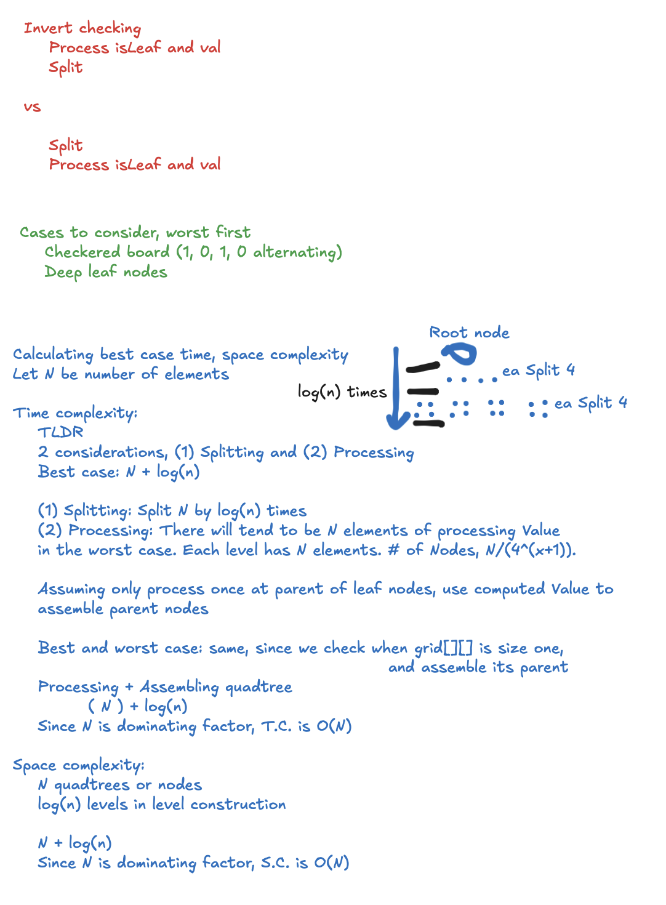

# Quadtree (Nov 2024)

## Files

```
.
├── main.js                 // Test logic
├── quadtree.js             // Class v1  
└── quadtree_concise.js     // Class v2 (new)
```

Run: `node main.js`

## Test Case 2

### Quadtree Grid

```javascript
ex_grid_2 = [
  [1, 1, 1, 1, 0, 0, 0, 0],
  [1, 1, 1, 1, 0, 0, 0, 0],
  [1, 1, 1, 1, 1, 1, 1, 1],
  [1, 1, 1, 1, 1, 1, 1, 1],
  [1, 1, 1, 1, 0, 0, 0, 0],
  [1, 1, 1, 1, 0, 0, 0, 0],
  [1, 1, 1, 1, 0, 0, 0, 0],
  [1, 1, 1, 1, 0, 0, 0, 0],
]
```

## Slice(), Flat(), Every()

### Key Operations
1. **Initialization (`constructor`)**:
   - The constructor checks if the grid is a leaf by flattening and checking uniformity of values.
   - **Complexity**: $O(N)$, where $N$ is the number of elements in the grid.

2. **Splitting the Grid (`split` method)**:
   - The grid is divided into 4 quadrants using `_processGrid` and `_sliceGrid`.
   - Slicing is performed for each quadrant:
     - `slice()` is $O(k)$, where $k$ is the number of elements being sliced.
     - Four quadrants are processed, and each has $\frac{N}{4}$ elements recursively.
   - **Time Complexity**: $O(N)$ per level of recursion (total work for 4 slices of $\frac{N}{4}$ elements).
   - This happens for $\log(N)$ levels (until each quadrant is size 1).

3. **Processing Nodes (`processQuad`)**:
   - It checks if all elements in the grid are 0 or 1 and if the grid is uniform.
   - Flattening (`flat()`) is $O(N)$, and the uniformity check is $O(N)$.
   - **Time Complexity**: $O(N)$.

4. **Recursive Rendering (`render`)**:
   - This method traverses the entire tree recursively.
   - Every node is visited once.
   - **Time Complexity**: $O(N)$ for traversal across $N$ elements.

## Current Strategy

### Time Complexity
1. **Tree Construction**:
   - The grid is split recursively, and at each level, the work is proportional to $O(N)$.
   - Total levels of recursion: $\log(N)$ (as the grid is divided by 4 at each step).
   - Total time complexity:
   $$O(N \cdot \log(N))$$

2. **Processing the QuadTree**:
   - Every node is processed at most once, and processing each node takes $O(N)$ time.
   - Combined with tree construction, the overall time complexity remains:
   $$O(N \cdot \log(N))$$

### Total Time Complexity:
$$
O(N \cdot \log(N))
$$

### Space Complexity
1. **Recursive Stack**:
   - Each level of recursion splits the grid into 4 quadrants and processes them.
   - Maximum depth of recursion: $\log(N)$ (as the grid size is halved at each step).
   - **Space Complexity for Recursive Stack**: $O(\log(N))$.

2. **Tree Storage**:
   - The tree consists of $O(N)$ nodes.
   - Each node stores a reference to its child nodes and a small amount of metadata.
   - **Space Complexity for Tree Storage**: $O(N)$.

3. **Temporary Storage (e.g., `slice()` results)**:
   - Temporary arrays for slicing are proportional to the size of the quadrants.
   - Total space for temporary storage: $O(N)$.

### Total Space Complexity:
$$
O(N)
$$

## New Strategy, Written Notes


## General Time Complexity

For a QuadTree:
- **Tree depth (\(D\))**: The maximum depth of the QuadTree.
- **Number of nodes (\(N\))**: Total number of nodes in the tree.

Each node may have up to four children (quadrants). The total number of nodes in a perfect QuadTree is given by:

$$
N = \sum_{i=0}^{D} 4^i = \frac{4^{D+1} - 1}{3}
$$

For large \(D\), we approximate \(N\) as:

$$
N \approx \frac{4^D}{3}.
$$

### **Time Complexity for Rendering**
If rendering involves visiting every node in the tree, the time complexity is proportional to \(N\), so:

$$
\text{Time Complexity} \approx O(4^D).
$$

## General Space Complexity

The space complexity depends on how many nodes are stored in memory:

- **Full Storage in Memory**: If the entire QuadTree is stored in memory, the space complexity is proportional to \(N\):

$$
\text{Space Complexity} \approx O(4^D).
$$

- **Depth-First Algorithms**: If only the current path from the root to a leaf is stored in memory, the space complexity depends on the depth \(D\):

$$
\text{Space Complexity} \approx O(D).
$$

## Sparse QuadTree Analysis

For non-perfect QuadTrees with sparse data, the number of nodes per level $(\(n_i\))$ may be fewer than $\(4^i\)$. For sparsity modeled as $\(n_i = c \cdot 4^i\)$, where $\(c < 1\)$ is a sparsity factor:

The total number of nodes becomes:

$$
N_{\text{sparse}} = \sum_{i=0}^D c \cdot 4^i = c \cdot \frac{4^{D+1} - 1}{3}.
$$

### **Time Complexity for Sparse QuadTrees**
For traversal or rendering:

$$
\text{Time Complexity} \approx O(c \cdot 4^D).
$$

## Conclusion

The complexities can be summarized as:

- **Time Complexity**:
  - Perfect QuadTree: $\(O(4^D)\)$
  - Sparse QuadTree: $\(O(c \cdot 4^D)\)$

- **Space Complexity**:
  - Full Storage: $\(O(4^D)\)$
  - Depth-First Path: $\(O(D)\)$

## Miscellaneous

### Summary of Complexities of my old implemented QuadTree

| **Operation**        | **Time Complexity**       | **Space Complexity**       |
|-----------------------|---------------------------|-----------------------------|
| **Tree Construction** | $O(N \cdot \log(N))$      | $O(N)$                      |
| **Tree Processing**   | $O(N \cdot \log(N))$      | $O(N)$                      |
| **Recursive Stack**   | -                         | $O(\log(N))$                |

### Definitions

#### Imperative vs Declarative
Imperative focuses on the *how*, while declarative focuses on the *what*.

The concise quadtree is more imperative than the first quadtree class. To achieve conciseness, named functions `_splitGrid` and `_processGrid` are removed. Instead, additional parameters in the constructor and in-line splitting when invoking the constructor are used.

The concise quadtree improves space complexity, from $O(N \cdot \log(N))$ to $O(N)$. The $O(\log(N))$ improvement is due to discarding a copy of elements at each level of the quadtrees.

## **1. Understanding the General QuadTree Complexity**

For a QuadTree, the operations like construction, traversal, or rendering typically depend on:
- **Tree depth ($D$)**: The maximum depth of the QuadTree.
- **Number of nodes ($N$)**: Total number of nodes in the tree.
  
Each node may have up to four children (quadrants). Hence, the complexity of many operations grows with the depth and the branching factor.

### **Key Observations:**
- The number of nodes increases geometrically at each level: $4^0, 4^1, 4^2, \dots$, up to depth $D$.
- The total number of nodes $N$ in a perfect QuadTree is given by:

$$
N = \sum_{i=0}^{D} 4^i = \frac{4^{D+1} - 1}{3}
$$

## **2. Taylor Series Analogy for Approximation**

The Taylor series allows approximations for functions near a certain point. Similarly:
- **For time complexity:** We analyze how the computation grows as $N$ or $D$ increases.
- **For space complexity:** We approximate how memory usage grows.

### **Time Complexity Estimation**

Consider an operation like rendering all nodes. The traversal cost is proportional to the number of nodes, so the time complexity is $O(N)$. Expanding $N$ from the formula:

$$
N \approx \frac{4^D}{3} \quad \text{for large } D.
$$

Using the first term as an approximation:

$$
\text{Time Complexity} \approx O(4^D).
$$

If you're processing each node (e.g., printing or summing values), $O(4^D)$ becomes your worst-case estimate.

### **Space Complexity Estimation**

The space complexity depends on how many nodes are stored in memory:
- If the QuadTree is built and stored entirely in memory, space complexity is proportional to $N$:

$$
\text{Space Complexity} \approx O(4^D).
$$

- For depth-first algorithms, if only the current path from the root to a leaf is stored in memory, the space complexity depends on the depth $D$:

$$
\text{Space Complexity} \approx O(D).
$$

## **3. Refining Estimates**

For non-perfect QuadTrees (with sparse data):
- **Sparse Nodes:** Nodes may not always split into 4 children, leading to fewer than $4^D$ total nodes. In such cases, you replace $4^i$ with the actual number of nodes per level $n_i$.

Using the Taylor series analogy:
1. **Expand around a reference point (e.g., a full tree):**
   - Approximate sparsity by modeling $n_i = c \cdot 4^i$, where $c < 1$ reflects sparsity.

2. **Truncate higher-order terms:**
   - Keep leading terms to estimate bounds:
     - For traversal: Keep the terms related to total nodes.
     - For depth-sensitive operations: Use terms related to $D$.

## **4. Practical Application**

### **Example Analysis for Rendering**
- **Perfect QuadTree:** $N \approx \frac{4^D}{3}$. Complexity is $O(4^D)$.
- **Sparse QuadTree:** If sparsity reduces each level to $n_i = c \cdot 4^i$, total nodes become:

$$
N_{\text{sparse}} = \sum_{i=0}^D c \cdot 4^i = c \cdot \frac{4^{D+1} - 1}{3}.
$$

  Complexity is $O(c \cdot 4^D)$.

## **Conclusion**

The Taylor series analogy helps approximate the **leading factors** of complexity (like $4^D$) while ignoring higher-order corrections for smaller tree levels. This approach provides insight into scaling behavior for large $D$ or $N$, useful for estimating bounds without directly calculating every operation.

